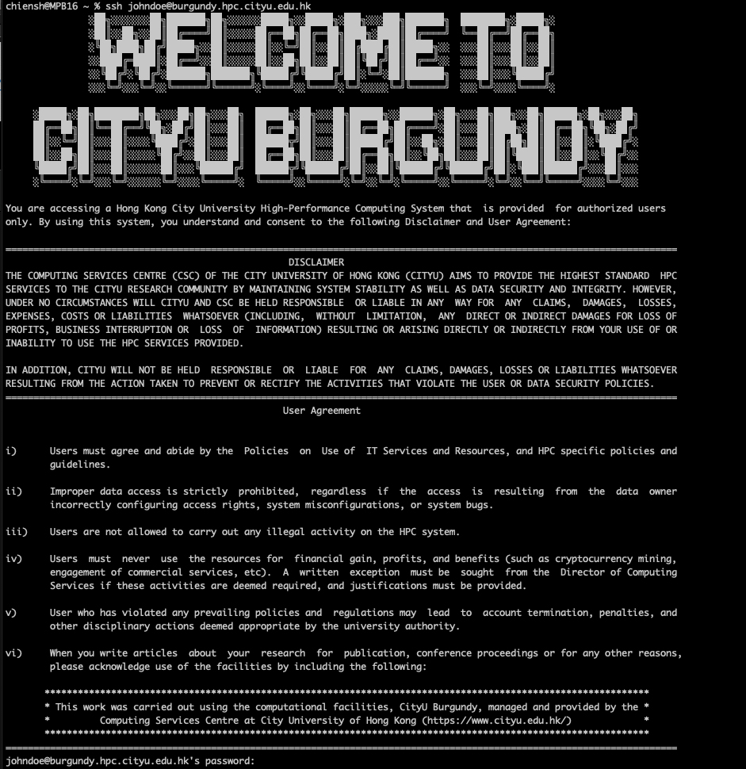
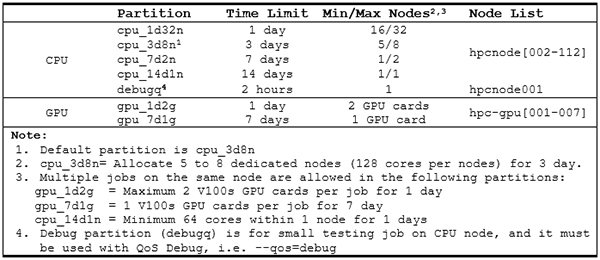
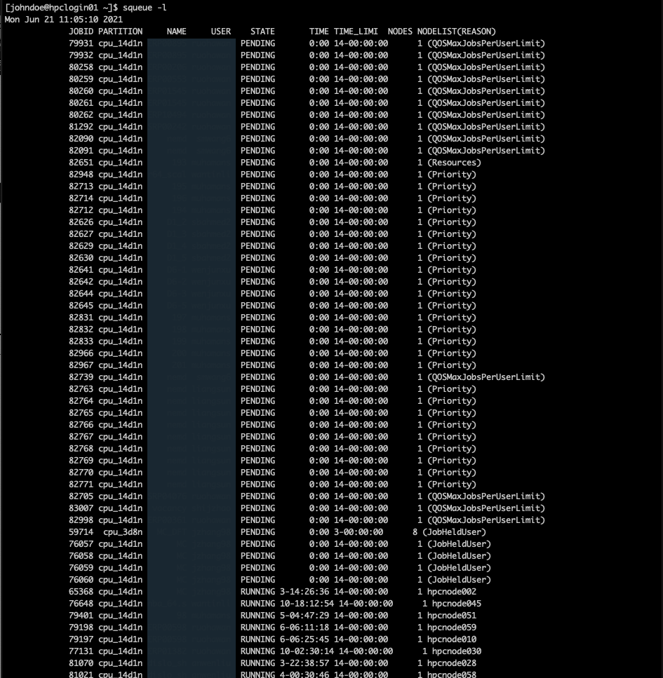
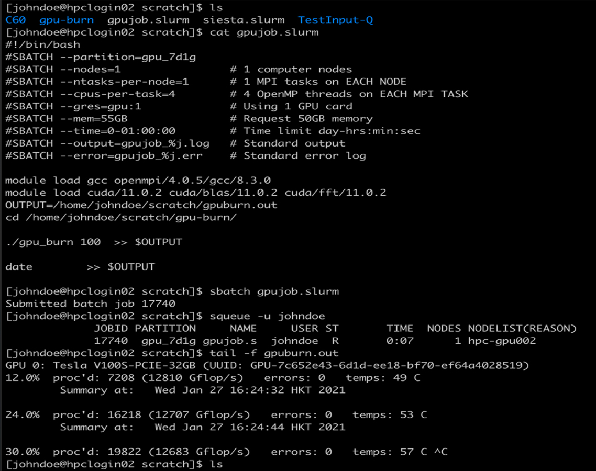
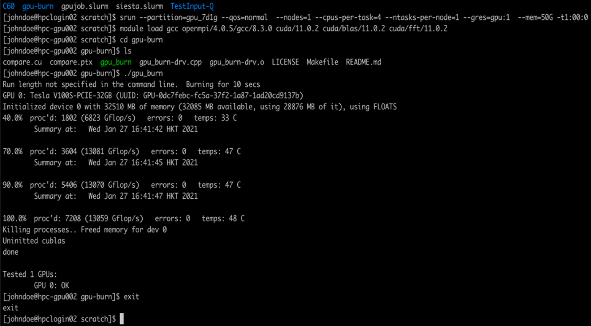
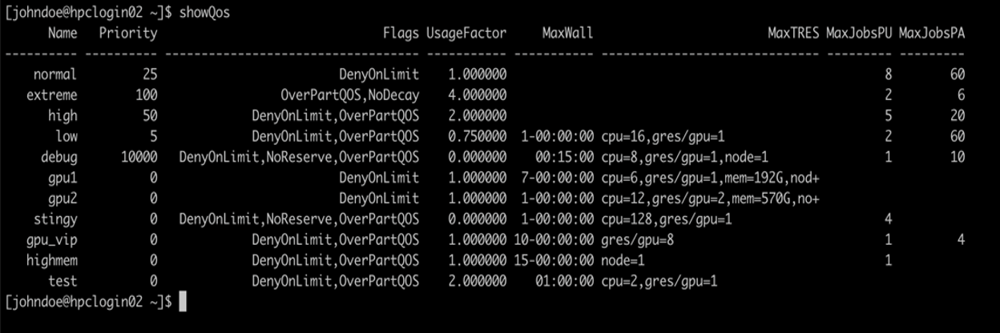
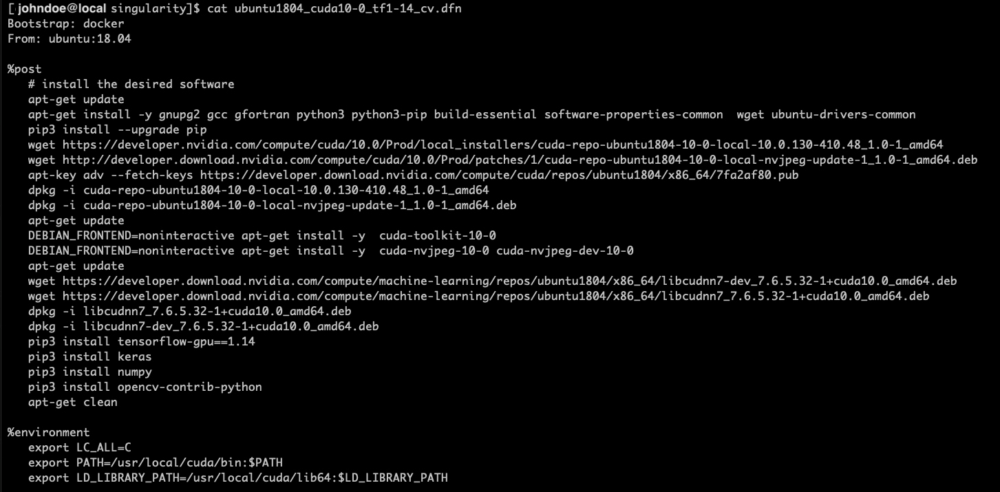

# User Guide for Accessing Central HPC Cluster (CityU Burgundy) --- 访问中央HPC集群用户指南（CityU Burgundy）

# User Guide for Accessing Central HPC Cluster (CityU Burgundy)  
访问中央HPC集群用户指南（CityU Burgundy）

*   [Access to the System  
    访问系统](#access)
*   [Job Submission  工作提交](#job)
*   [General Guidelines for Job Submission  
    作业提交的一般准则](#guidelines)
*   [Disk Storage and Quota  
    磁盘存储和配额](#diskstorage)
*   [Software Stacks 软件堆栈](#software)

## Access to the System  
访问系统

*   There is no graphical user interface for Burgundy, users must logon the system with Secure Shell (SSH), and “x forwarding with SSH” is supported with -Y option.  
    Burgundy 没有图形用户界面，用户必须使用 Secure Shell (SSH) 登录系统，并且 -Y 选项支持“使用 SSH 进行 x 转发”。
*   Use PuTTY (on Window) or Terminal (Linux or Mac) to access Burgundy.  
    使用 PuTTY（在 Window 上）或终端（Linux 或 Mac）访问 Burgundy。
*   Users should login to the system with CityU EID and Password. At the SSH terminal, type:  
    用户应使用 CityU EID 和密码登录系统。在 SSH 终端输入：
    
    > ssh <EID>@burgundy.hpc.cityu.edu.hk  
    > ssh @burgundy.hpc.cityu.edu.hk
    > 
    > OR
    > 
    > ssh <EID>@144.214.138.99  
    > ssh @144.214.138.99
    
*   PuTTY can be downloaded from [https://www.putty.org/](https://www.putty.org/)  
    PuTTY 可以从 https://www.putty.org/ 下载



## Job Submission 工作提交

1.  General Policy Statement 一般政策声明  
    _The current scheduling policy and resource restrictions, including partition, quota, and charging scheme, are temporary. The final design will be discussed, decided, and regularly reviewed by the User Committee.  
    当前的调度策略和资源限制，包括分区、配额和计费方案，都是临时的。最终设计将由用户委员会讨论、决定并定期审查。_
2.  Partitions and Priority  分区和优先级
    1.  Job Partitions  作业分区
        *   7 CPU/GPU partitions are currently available for all users  
            目前7个CPU/GPU分区可供所有用户使用  
            
    2.  Special Partitions  特殊分区
        *   Please contact the HPC administrator if you need to use below partitions, or you have special needs.  
            如果您需要使用以下分区，或者有特殊需求，请联系HPC管理员。
    3.  Job Priority 工作优先级  
        
    
    *   Instead of using FIFO scheduling scheme, the scheduling priority on the HPC depends on several factors: Job Size, Job Ages, Quality of Service (QoS), Usage history (Fair Share) and the Partition Properties.  
        HPC 上的调度优先级不是使用 FIFO 调度方案，而是取决于几个因素：作业大小、作业期限、服务质量 (QoS)、使用历史记录（公平共享）和分区属性。
    *   Ref.  [https://slurm.schedmd.com/classic\_fair\_share.html](https://slurm.schedmd.com/classic_fair_share.html)  
        参考号https://slurm.schedmd.com/classic\_fair\_share.html
    *   We are working with external consultants to enhance the scheduling policy to ensure fairness.  
        我们正在与外部顾问合作，完善调度政策以确保公平性。
    *   We favour multi-node jobs by offering higher scheduling priorities for these partitions. However, intentionally requesting excessive resource to take advantage of this policy is strictly prohibited. Users’ actual workloads are closely monitored, and repeated offenders of this rule will lead to account suspensions.  
        我们通过为这些分区提供更高的调度优先级来支持多节点作业。但是，严禁故意请求过多资源来利用此政策。用户的实际工作负载受到密切监控，屡次违反此规则将导致帐户被暂停。
    
3.  Job Scheduler and Submission  
    作业调度和提交
    1.  Job Scheduler 作业调度程序
    
    *   Simple Linux Utility for Resource Management (SLURM) is an open source, fault-tolerant, and highly scalable cluster management and job scheduling system for large and small Linux clusters. It has been widely used in many HPC centres.  
        Simple Linux Utility for Resource Management (SLURM) 是一个开源、容错且高度可扩展的集群管理和作业调度系统，适用于大型和小型 Linux 集群。它已在许多HPC中心广泛使用。
    *   Ref. https://slurm.schedmd.com/overview.html  
        参考号https://slurm.schedmd.com/overview.html  
        
    
    3.  Job submission 作业提交  
        *   HPC users must familiarise themselves with SLURM commands in order to send their workloads to appropriate computational resources (CPU and GPU nodes). Four frequently used commands include sinfo, squeue, sbatch, &amp; scancel.  
            HPC 用户必须熟悉 SLURM 命令，才能将其工作负载发送到适当的计算资源（CPU 和 GPU 节点）。四个常用命令包括 sinfo、squeue、sbatch 和 scancel。  
              
            **Useful SLURM Commands: 有用的 SLURM 命令：**  
              
              
              
            
            |     |     |     |     |     |     |     |
            | --- | --- | --- | --- | --- | --- | --- |
            | **squeue 排队** |     | to check status of your jobs  <br>检查您的工作状态 |     |
            |  |     |     |     |
            | _Job State Codes: 作业状态代码：  <br>__(_[_https://slurm.schedmd.com/squeue.html#lbAG_](https://slurm.schedmd.com/squeue.html#lbAG)_)_  <br>(https://slurm.schedmd.com/squeue.html#lbAG) |     |     |     |
            | RUNNING 跑步 | **R** |     | The job currently is allocated to a node and is running.  <br>该作业当前已分配到一个节点并正在运行。 |
            | PENDING 待办的 | **PD** |     | The job is waiting for resource allocation. It will eventually run.  <br>该作业正在等待资源分配。它最终会运行。 |
            | COMPLETING 正在完成 | **CG** |     | The job is finishing but some processes are still active.  <br>作业正在完成，但某些进程仍然处于活动状态。 |
            | COMPLETED 完全的 | **CD** |     | The job has completed successfully.  <br>作业已成功完成。 |
            | FAILED 失败的 | **F** |     | The job terminated with a non-zero exit code and failed to execute.  <br>该作业以非零退出代码终止并且无法执行。 |
            | PREEMPTED 抢占 | **PR** |     | The job was terminated because of preemption by another job.  <br>该作业因被另一个作业抢占而终止。 |
            | SUSPENDED 暂停 | **S** |     | A running job has been stopped with its cores released to other jobs.  <br>正在运行的作业已停止，其核心被释放给其他作业。 |
            | STOPPED 停止 | **ST** |     | A running job has been stopped with its cores retained.  <br>正在运行的作业已停止，但保留了其核心。 |
            
            |     |     |     |     |     |
            | --- | --- | --- | --- | --- |
            | _Job Reason Codes: 工作原因代码：  <br>_([_https://slurm.schedmd.com/resource\_limits.html_](https://slurm.schedmd.com/resource_limits.html)_)_  <br>(https://slurm.schedmd.com/resource\_limits.html) |     |     |
            | Resource 资源 | The job is waiting for resources to become available and will eventually run.  <br>该作业正在等待资源可用并最终运行。 |     |
            | Priority 优先事项 | One or more higher priority jobs is in queue for running. Your job will eventually run.  <br>一个或多个优先级较高的作业正在队列中等待运行。你的工作最终会运行。 |     |
            | QOS(_Resource_)Limit QOS(资源)限制 | Maximum resource for your job’s QoS have been met.  <br>已满足作业 QoS 的最大资源。 |     |
            | _MaxJobsPerUser 每个用户的最大作业数_ | The maximum number of jobs a user can have running at a given time.  <br>用户在给定时间可以运行的最大作业数。 |     |
            | _MaxJobsPerAccount 每个帐户的最大作业数_ | The maximum number of jobs an account (or subaccount) can have running at a given time.  <br>账户（或子账户）在给定时间可以运行的最大作业数。 |     |
            | _GrpWall 墙体_ | The maximum wall clock time running jobs are able to be allocated in aggregate for a QoS or an association and its children. If this limit is reached, future jobs in this QoS or association will be queued until they are able to run inside the limit.  <br>可以为 QoS 或关联及其子项聚合分配运行作业的最大挂钟时间。如果达到此限制，则此 QoS 或关联中的未来作业将排队，直到它们能够在限制内运行。 |     |
            | _GrpTRES 组TRES_ | The total count of TRES able to be used at any given time from jobs running from an association and its children or QoS  <br>从关联及其子级运行的作业在任何给定时间能够使用的 TRES 总数或 QoS |     |
            | _GrpTRESMins 组TRES分钟_ | The total number of TRES minutes that can possibly be used by past, present and future jobs running  <br>过去、现在和将来运行的作业可能使用的 TRES 分钟总数 |     |
            |     |     |     |
            | **sbatch <script> sbatch <脚本>** |     | to submit a batch job  <br>提交批处理作业 |
            | **scancel <job id> scancel <作业 ID>** |     | to kill a waiting or running job  <br>终止正在等待或正在运行的作业 |
            
            **  
            Batch Submission: 批量提交：**
            *   A submission script is required to submit a batch job to the system.  
                需要使用提交脚本来向系统提交批处理作业。
            *   The syntax of the SLURM script is similar to a standard shell script:  
                SLURM 脚本的语法类似于标准 shell 脚本：
                *   The main portion of the script is a standard Linux bash/cash script that will be executed on the compute nodes.  
                    该脚本的主要部分是一个标准的 Linux bash/cash 脚本，它将在计算节点上执行。
                *   Lines beginning with #SBATCH are SLURM instructions will only be read by the SLURM scheduler, i.e. these SLURM instruction lines will only be considered as comments by the Linux shell.  
                    以 #SBATCH 开头的行是 SLURM 指令，只会由 SLURM 调度程序读取，即这些 SLURM 指令行只会被 Linux shell 视为注释。
            *   Here is an example of a submission script for a CPU node job.  
                以下是 CPU 节点作业的提交脚本示例。  
                  
                
                ```plain
                #!/bin/bash
                #SBATCH --partition=cpu_14d1n
                #SBATCH --nodes=1                # 1 computer nodes
                #SBATCH --ntasks-per-node=32     # 32 MPI tasks on EACH NODE
                #SBATCH --cpus-per-task=4        # 4 OpenMP threads on EACH TASK, i.e. 1x32x4=128 cores
                #SBATCH --mem=440GB              # 440GB mem on EACH NODE
                #SBATCH --time=10:00:00          # Time limit hrs:min:sec
                #SBATCH --output=C60_%j.log      # Standard output
                #SBATCH --error=C60_%j.err       # Standard error log
                module load  intel/2020.2.254
                module load  intelmpi/2019.8.254
                SIESTA=/cm/shared/apps/chemistry/siesta/4.1-266/bin/siesta
                OUTPUT=/home/johndoe/scratch/C60.output
                
                cd /home/johndoe/scratch/C60/1
                mpirun -genv OMP_NUM_THREADS=4 -genv I_MPI_PIN=1 -genv OMP_PROC_BIND=true -genv OMP_PLACES=cores $SIESTA  < input.fdf > $OUTPUT
                
                date >>$OUTPUT
                ```
                
                  
                
                
                
            *   Here is another example of a submission script for a one GPU job.  
                以下是一个 GPU 作业的提交脚本的另一个示例。  
                  
                
                ```plain
                #!/bin/bash
                #SBATCH --partition=gpu_7d1g
                #SBATCH --nodes=1                # 1 computer nodes
                #SBATCH --ntasks-per-node=1      # 1 MPI tasks on EACH NODE
                #SBATCH --cpus-per-task=4        # 4 OpenMP threads on EACH MPI TASK
                #SBATCH --gres=gpu:1             # Using 1 GPU card
                #SBATCH --mem=55GB               # Request 50GB memory
                #SBATCH --time=0-01:00:00        # Time limit day-hrs:min:sec
                #SBATCH --output=gpujob_%j.log   # Standard output
                #SBATCH --error=gpujob_%j.err    # Standard error log
                
                module load gcc openmpi/4.0.5/gcc/8.3.0
                module load cuda/11.0.2 cuda/blas/11.0.2 cuda/fft/11.0.2
                OUTPUT=/home/johndoe/scratch/gpuburn.out
                cd /home/johndoe/scratch/gpu-burn/
                
                ./gpu_burn 100  >> $OUTPUT
                
                date        >> $OUTPUT
                ```
                
                  
                
                
                
                **  
                Interactive Scheduling: 互动调度：**
                
                WARNING: Users are not encouraged to use interactive scheduling for long production computation, and interactive jobs may be terminated due to the heavy workloads on the login node. Limitations on the use of Interactive Scheduling will be implemented soon.  
                警告：不鼓励用户使用交互式调度进行长时间的生产计算，并且交互式作业可能会由于登录节点上的繁重工作负载而终止。交互式调度的使用限制将很快实施。
                
                *   For certain kinds of workloads that require manual manipulations during the computation, users may request for an interactive scheduling.  
                    对于某些在计算过程中需要手动操作的工作负载，用户可以请求交互式调度。
                *   Here is an example of an interactive job for requesting one GPU:  
                    以下是请求一个 GPU 的交互式作业的示例：  
                      
                    
                    ```plain
                    srun --partition=gpu_7d1g --qos=normal  --nodes=1 --cpus-per-task=4 --ntasks-per-node=1 
                    --gres=gpu:1  --mem=50G -t1:00:0 --pty bash -i 
                    ```
                    
                      
                    
    4.  Quality of Service (QoS)  
        服务质量 (QoS)
    
    *   QoS have been implemented in SLURM; it may affect the jobs in a few different aspects, e.g.  
        QoS已在SLURM中实现；它可能会在几个不同方面影响工作，例如
        *   Job Scheduling Priority (To be implemented in the future)  
            作业调度优先级（未来实施）
        *   Job Limit (To be implemented in the future)  
            职位限制（未来实施）
        *   Charging (To be implemented in the future), and  
            充电（将来实施），以及
        *   Access of Special Resources  
            特殊资源的获取
    *   QoS will be added, deleted or modified in due course based on the needs without advance notice to users  
        QoS将根据需要适时增加、删除或修改，恕不另行通知用户
    *   Users can use command **showQos** to check all QoSs on the system  
        用户可以使用命令 showQos 查看系统上的所有 QoS  
          
        
    *   There are 2 types of QoSs:  
        有 2 种类型的 QoS：
        *   Partition-QoS (i.e. gpu1 and gpu2) are used to define the partition properties, and they should not be defined inside the job script by users; they will be observed if a conflated User-QoS is defined within the job script. However, certain special QoS can override the limits defined by Partition-QoS (with OverParQOS Flag)  
            Partition-QoS（即gpu1和gpu2）用于定义分区属性，用户不应在作业脚本中定义它们；如果在作业脚本中定义了合并的用户 QoS，则会观察到它们。然而，某些特殊的 QoS 可以覆盖 Partition-QoS 定义的限制（带有 OverParQOS 标志）
        *   User-QoS can be specified by users in the job script. Default QoS for most users is normal, (low for undergraduate projects and training courses).  
            User-QoS 可以由用户在作业脚本中指定。大多数用户的默认 QoS 是正常的（本科项目和培训课程较低）。
            *   _normal_ QoS has a priority factor=25, 8 concurrent RUNNING JOBS are allowed per user; and 60 concurrent RUNNING JOBS for each departmental account (i.e. users from the same department) are allowed.  
                普通 QoS 的优先级因子=25，每个用户允许 8 个并发运行作业；每个部门帐户（即来自同一部门的用户）允许同时运行 60 个作业。
            *   _high_ & _extreme_ are reserved for future use when the charging scheme is effective.  
                high 和Extreme 保留供将来在收费方案有效时使用。
            *   _highmem_ and _gpu\_vip_ are assigned to the users who can access the high memory node, and the whole GPU nodes, respectively, under special arrangements.  
                在特殊安排下，highmem 和 gpu\_vip 分别分配给可以访问高端内存节点和整个 GPU 节点的用户。
            *   _debug_ QoS is for users to test and verify their submission script before actual submission, so it has a very high priority factor and very tight resource limitations  
                debug QoS是为了用户在实际提交之前测试和验证他们的提交脚本，因此它具有非常高的优先级因素和非常严格的资源限制
            *   _stingy_ QoS is for users who want to run jobs with the lowest priority without charging (UsageFactor=0). These jobs may be preempted (suspended, re-queued or terminated) when higher priority jobs are submitted to the system.  
                吝啬 QoS 适用于希望以最低优先级运行作业且不收费的用户 (UsageFactor=0)。当更高优先级的作业提交到系统时，这些作业可能会被抢占（挂起、重新排队或终止）。
    

## General Guidelines for Job Submission  
作业提交的一般准则

1.  **Favour Large Jobs Policy 支持大量就业政策**  
    *   Users are encouraged to speed up the computational time by running parallel jobs across multiple nodes whenever possible, and thus we favour multi-node partitions by offering higher scheduling priorities within a shorter time limit.  
        我们鼓励用户尽可能通过在多个节点上运行并行作业来加快计算时间，因此我们通过在更短的时间限制内提供更高的调度优先级来支持多节点分区。
    *   However, using excessive number of CPU/Nodes will slow down the computation because communication latency overtakes the computational time. ([https://hpc.llnl.gov/tutorials/introduction-parallel-computing/limits-and-costs-parallel-programming](https://hpc.llnl.gov/tutorials/introduction-parallel-computing/limits-and-costs-parallel-programming))  
        然而，使用过多的 CPU/节点会减慢计算速度，因为通信延迟会超过计算时间。 （https://hpc.llnl.gov/tutorials/introduction-parallel-computing/limits-and-costs-parallel-programming）
    *   Users should benchmark their typical jobs with different combinations of MPI tasks and OpenMP threads on different number of nodes to obtain the best performance of the jobs.  
        用户应在不同数量的节点上使用 MPI 任务和 OpenMP 线程的不同组合对其典型作业进行基准测试，以获得作业的最佳性能。
2.  **Use Batch Submission 使用批量提交**  
    *   Long interactive scheduling is strongly discouraged, and we will implement policy to regulate the unnecessary usage of it in the near future.  
        强烈建议不要长时间交互调度，我们将在不久的将来实施政策来规范不必要的使用。
        *   Each interactive scheduling will consume certain resource on the login node shared amongst all login users.  
            每次交互调度都会消耗所有登录用户共享的登录节点上的一定资源。
        *   There is a risk for an abnormal job termination when the login node has encountered a network or system hiccup.  
            当登录节点遇到网络或系统故障时，存在作业异常终止的风险。
    *   Users should submit their jobs with batch scripts as far as possible. (i.e. avoid using interactive scheduling)  
        用户应尽可能使用批处理脚本提交作业。 （即避免使用交互式调度）
    *   Users should clearly specify the resource requirements, i.e. i) **Number of Nodes**, ii) **Number of MPI Tasks per Node**, iii) **OpenMP Threads per MPI Task**, iv) **Memory requirement per Node** in the submission script, otherwise the default value will be applied (i.e. 1 cpu and 3.5GB memory) despite the whole node being allocated.  
        用户应在提交脚本中明确指定资源要求，即 i) 节点数，ii) 每个节点的 MPI 任务数，iii) 每个 MPI 任务的 OpenMP 线程数，iv) 每个节点的内存要求，否则将应用默认值（即 1 个 cpu 和 3.5GB 内存）尽管分配了整个节点。
    *   Because of _backfilling algorithm_, waiting time can be significantly reduced if a smaller **Time Limit** has been specified in the job script.  
        由于回填算法，如果在作业脚本中指定较小的时间限制，则可以显着减少等待时间。
3.  **Use of Local Scratch 使用局部划痕**

*   Many jobs can take advantage of local scratch, and there is a 350GB local scratch at “/local” on each compute node.  
    许多作业可以利用本地暂存，每个计算节点上的“/local”都有 350GB 的本地暂存。
*   Users should remove all data on the local scratch when the computational task is completed. All data on the local scratch are not retrievable when the allocation is finished.  
    当计算任务完成时，用户应该删除本地暂存上的所有数据。分配完成后，本地暂存上的所有数据都不可检索。  
    

## Disk Storage and Quota  
磁盘存储和配额

1.  **General Storage Policies 一般存储策略**

1.  User Guidelines 用户指南

*   It is the users’ responsibility to maintain and backup their own data on the HPC system.  
    用户有责任维护和备份自己在 HPC 系统上的数据。
*   Users should only store research related data on the HPC storage system, and the HPC storage should not be considered as a permanent or backup data storage. All non-researched related or unused data found on the system will be erased without advance notice.  
    用户应仅将研究相关数据存储在HPC存储系统上，并且HPC存储不应被视为永久或备份数据存储。系统上发现的所有非研究相关或未使用的数据将被删除，恕不另行通知。
*   Any illegal data or material found on the file system will be reported to the authority; related user accounts will be frozen, and the related data will be erased when the investigation is finished; users cannot claim for any loss because of this.  
    在文件系统中发现任何非法数据或材料将向主管部门报告；调查结束后，相关用户账户将被冻结，相关数据将被删除；用户不能因此而索赔。

3.  Data Backup 数据备份

*   There is **no** data backup service for the HPC service currently, but we will consider providing this service at a later stage.  
    目前HPC服务还没有数据备份服务，但我们会考虑在后期提供此服务。

3.  **Disk Quota 磁盘配额**  
    
    The disk quota scheme has not been enforced yet, but it will be implemented in the near future. The following scheme has been proposed, and users may use it as a reference at this stage.  
    磁盘配额计划尚未实施，但将在不久的将来实施。提出了如下方案，现阶段用户可以作为参考。
    
    1.  Home Directory: 50GB fixed  
        主目录：固定 50GB
        *   Persistent (i.e. no time limit) home space for user login.  
            用于用户登录的持久（即无时间限制）主空间。
        *   Suitable for the following data:  
            适用于以下数据：
            *   essential files for user login  
                用户登录的基本文件
            *   users’ self-maintained libraries and applications  
                用户自行维护的库和应用程序
            *   templates for inputs and submission scripts.  
                输入和提交脚本的模板。
    2.  Scratch Directory: 300GB by default  
        暂存目录：默认300GB
    
    *   A working space for users to carry out computational jobs  
        供用户执行计算工作的工作空间
        *   Storing inputs, outputs and temporary/scratch files  
            存储输入、输出和临时/临时文件
    *   Unused files will be erased regularly.  
        未使用的文件将定期删除。
        *   Users should backup the important data on their own local storage when the job is finished.  
            作业完成后，用户应将重要数据备份到自己的本地存储上。
    *   Additional space can be arranged upon request with justification. Each case will be considered individually.  
        可根据要求并有理由安排额外的空间。每个案例都会被单独考虑。
    
    4.  NAS (Will be implemented in future)  
        NAS（未来将实现）

##   
Software Stacks 软件堆栈

1.  **Environment Modules 环境模块  
    **
    
    Lmod Environment Modules have been used to manage the software packages on the HPC system, and users can dynamically change their software environment through modulefiles.  
    Lmod环境模块已用于管理HPC系统上的软件包，用户可以通过模块文件动态更改其软件环境。  
    ([https://lmod.readthedocs.io/en/latest/](https://lmod.readthedocs.io/en/latest/))  
    ( https://lmod.readthedocs.io/en/latest/)
    
    There is a public modulefile set managed by the Computing Services Centre (CSC); the environment variable MODULEPATH has been set as follows by default.  
    有一个由计算服务中心（CSC）管理的公共模块文件集；环境变量 MODULEPATH 默认设置如下。  
      
    
    ```plain
    MODULEPATH=/cm/local/modulefiles:/etc/modulefiles:/usr/share/modulefiles:/usr/share/Modules/modulefiles:/cm/shared/modulefiles/compiler:/cm/shared/modulefiles/library:/cm/shared/modulefiles/mpi:/cm/shared/apps/mpi/hpcx/2.8.0/modulefiles
    ```
    
      
      
    The current modulefile set is minimal, and we are preparing a more comprehensive set which covers more scientific applications and programming tools. Users will be informed when the new environment set is ready.  
    当前的模块文件集很小，我们正在准备一个更全面的集，其中涵盖更多的科学应用程序和编程工具。当新环境集准备就绪时，用户将收到通知。
2.  **Use of Environment Modules  
    环境模块的使用**

1.  Common module commands 常用模块命令  
    
2.  Append self-maintained module set  
    追加自维护模块集  
    
    Users can create their own modulefile set by appending the path of the directories which contain the modulefiles to the MODULEPATH variable.  
    用户可以通过将包含模块文件的目录路径附加到 MODULEPATH 变量来创建自己的模块文件集。
    
    The syntax of modulefile can be found on this web page:  
    modulefile的语法可以在这个网页上找到：  
    [https://lmod.readthedocs.io/en/latest/100\_modulefile\_examples.html](https://lmod.readthedocs.io/en/latest/100_modulefile_examples.html)
    

4.  **Singularity Containers 奇点容器**  
    
    Users are encouraged to install their own application packages as a Singularity container image ([https://sylabs.io/guides/3.7/user-guide/](https://sylabs.io/guides/3.7/user-guide/)) on their own desktop/workstation/labtop, and run it on Burgundy’s GPU node.  This is the only method to run customised system environment (e.g. a different Linux distro such as Ubuntu 18) or libraries (e.g. python 2, unsupported libgc) or optimised AI packages prepared by Nvidia.  
    鼓励用户将自己的应用程序包作为 Singularity 容器映像（https://sylabs.io/guides/3.7/user-guide/）安装在自己的桌面/工作站/labtop 上，并在 Burgundy 的 GPU 节点上运行。这是运行定制系统环境（例如不同的 Linux 发行版，如 Ubuntu 18）或库（例如 python 2、不支持的 libgc）或 Nvidia 准备的优化 AI 包的唯一方法。
    
    Users can build their own singularity with the following reference:  
    用户可以参考以下内容构建自己的奇点：  
    ([https://sylabs.io/guides/3.7/user-guide/quick\_start.html#build-images-from-scratch](https://sylabs.io/guides/3.7/user-guide/quick_start.html#build-images-from-scratch))  
    （https://sylabs.io/guides/3.7/user-guide/quick\_start.html#build-images-from-scratch）  
      
    
    |     |     |     |
    | --- | --- | --- |
    | i) Prepare a definition file under a X86-64 Linux environment.  <br>i) 在X86-64 Linux环境下准备定义文件。<br><br>*   In this example, we will install the packages, such as gcc and python, with apt-get on Ubuntu 18.04 images.  <br>    在此示例中，我们将使用 apt-get 在 Ubuntu 18.04 映像上安装 gcc 和 python 等软件包。<br>*   CUDA 10.0 libraries directly downloaded from Nvidia will be installed.  <br>    将安装直接从 Nvidia 下载的 CUDA 10.0 库。<br>*   Tensorflow (with GPU supported), numpy and OpenCV will be installed with pip within the image subsequently.  <br>    随后，Tensorflow（支持 GPU）、numpy 和 OpenCV 将与 pip 一起安装在映像中。<br><br> |
    | ii) Build image with Singularity command. This example was done on a CentOS Linux VM (Virtual Box) under MacOS  <br>ii) 使用 Singularity 命令构建图像。此示例是在 MacOS 下的 CentOS Linux VM（Virtual Box）上完成的  <br>  <br> |
    | iii) Upload the Singularity image to HPC Login Node  <br>iii) 将 Singularity 镜像上传到 HPC 登录节点  <br>  <br> |
    | iv) Submit the job and request the resource; in this example, an interactive schedule is used for illustration purpose only, and users should submit batch jobs if possible.  <br>iv) 提交作业并请求资源；在此示例中，交互式计划仅用于说明目的，用户应尽可能提交批处理作业。<br><br>*   Login to system, and submit an interactive job  <br>    登录系统，提交交互式作业  <br>      <br>    <br>*   When the resource is allocated, the prompt will change to indicate which node has been assigned (i.e. hpc-gpu005 in this case).  <br>    分配资源时，提示符将更改以指示已分配哪个节点（即本例中的 hpc-gpu005）。  <br>      <br>    For illustration purpose, we show the distro information of the Base System; it is a CentOS 8  <br>    为了便于说明，我们显示了基本系统的发行版信息；它是 CentOS 8  <br>      <br>    <br>*   Execute Linux commands from the singularity image.  <br>    从奇点映像执行 Linux 命令。  <br>    First, we ask to show the distro information of the client (the image), and it is a Ubuntu 18.04  <br>    首先，我们要求显示客户端（镜像）的发行版信息，它是 Ubuntu 18.04  <br>      <br>    <br>*   Then, we call python3 from the image.  <br>    然后，我们从图像中调用 python3。  <br>      <br>     |
    
      
    
5.  **Other Licensed Software 其他许可软件**

1.  Matlab MATLAB  
    
    A copy of Matlab has been installed, and you can find Matlab R2002b at the following location:  
    Matlab 的副本已安装，您可以在以下位置找到 Matlab R2002b：  
      /cm/shared/apps/maths/matlab/R2020b/bin  
    /cm/shared/apps/maths/matlab/R2020b/bin  
      
    CityU’s Matlab license servers are reachable to all nodes, and users may include this in their license files if they prefer to run their own copy of Matlab.  
    城大的 Matlab 许可证服务器可访问所有节点，如果用户希望运行自己的 Matlab 副本，则可以将其包含在其许可证文件中。  
    
    ```plain
    ############################################################
    SERVER berkeley101.ad.cityu.edu.hk 005056981E16 27000
    SERVER berkeley102.ad.cityu.edu.hk 005056988B9D 27000
    SERVER berkeley103.ad.cityu.edu.hk 005056981B97 27000
    USE_SERVER
    ############################################################
    ```
    
2.  Other Commercial Software  
    其他商业软件  
    Due to the license issue, the CSC will help to install shared license to the license server, but we cannot provide support for any user-owned license packages. Please contact the distributor of the software for support.  
    由于许可证问题，CSC将帮助将共享许可证安装到许可证服务器，但我们无法为任何用户拥有的许可证包提供支持。请联系该软件的经销商以获得支持。
