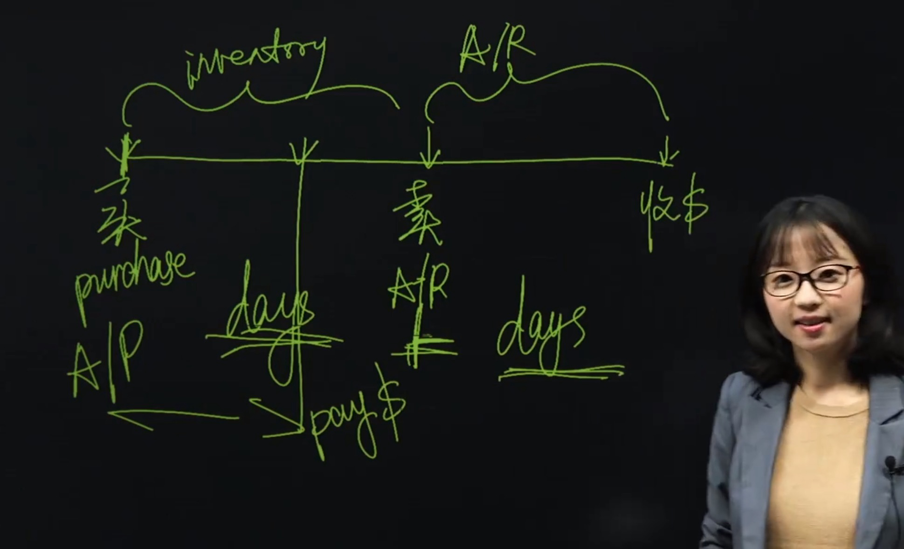

# Ratio Analysis

- activity ratio
- liquidity ratio
- solvency ratio
- profitability ratio

## Activity Ratio

- Inventory Turnover: COGS/Average Inventory
- Receivable Turnover: Net Revenue/Average Receivable
- Payable Turnover: Purchases/Average Payable

$$
\text{Operating Cycle} = \text{Collection Period} + \text{Inventory Period}
\text{Cash Conversion Cycle} = \text{Operating Cycle} - \text{Payment Period}
$$

- Total Asset Turnover: Net Revenue/Average Total Asset
- Fixed Asset Turnover: Net Revenue/Average Fixed Asset
- Working Capital Turnover: Net Revenue/Average Working Capital

<!-- red color -->

流量比存量，存量取平均。

## Liquidity Ratio

- Current Ratio: Current Asset/Current Liability
- Quick Ratio: (Current Asset - Inventory)/Current Liability 因为 Inventory 不易变现，所以不算在 Quick Ratio 里面
- Cash Ratio: (Cash + Marketable Securities)/Current Liability 几天内能偿还债务，从Quick Ratio 到 Cash Ratio 刨除了 Receivable
- Defensive Interval (Days): (Cash + Marketable Securities + Receivable)/average Daily Operating Expense

## Solvency Ratio

也叫杠杆比率

- Debt ratio:

| Ratio | Numerator | Denominator |
| --- | --- | --- |
| Debt-to-assets | Total Debt | Total Asset |
| Debt-to-capital   刨去免费融资，比如应付货款  | Total Debt | Total Debt + Total Equity  debt 指的是 interest-bearing debt  |
| Debt-to-equity  杠杆，自有资金撬动多少外部资金 | Total Debt | Total Equity |
| Financial Leverage | Average Total Asset | Average Total Equity |

- Coverage ratio:

| Ratio | Numerator | Denominator |
| --- | --- | --- |
| Interest Coverage | EBIT (Earnings Before Interest and Tax) | Interest Expense |
| Fixed Charge Coverage | EBIT + Lease Payment | Interest Expense + Lease Payment |

> Lease Payment 是租赁费用，因为租赁费用是固定的，所以要加到 EBIT 里面

## Profitability Ratio

- Gross Margin: Gross Profit/Net Revenue
- Operating profit margin: EBIT/Net Revenue
- Pre-tax margin: EBT/Net Revenue
- Net profit margin: Net Income/Net Revenue
- Return on Asset (ROA): Net Income/Average Total Asset
- Return on Equity (ROE): Net Income/Average Total Equity
- Return on total capital: EBIT/Average Total Capital  EBIT 除以总资本 
