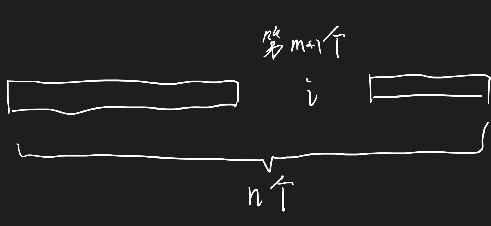

# Monte Carol Simulation for Shapley Value

## Notation

- $n$ 是数据集大小

## Shapley value

Shapley value 的加权方式是，抽取$m$个数据时算出的value提供相同的权重。

$$
\phi_i = C \sum_{S \subseteq N = S - \{i\}} \binom{n-1}{|S|}^{-1} (v(S \cup \{i\}) - v(S))
$$

因为这里满足 $|S| = m$的 $S$ 的数量是 $\binom{n-1}{m}$.

## Monte Carol Simulation

观点：文章中给出的办法是对的

原因：

他的采样方法不是直接从 $2^n$ 个子集中随机选取，而是随机选取排列，然后直接计算平均。

如图是抽取的一个排列，我要说明，$i$ 排在第 $m+1$ 个位置的时候，对应的是 $|S| = m$. 这里给出的关系是

**$i$ 排在第 $m+1$ 个位置的时候，对应的是 $|S| = m$**

而由于是 uniform distribution, 那么 $i$ 在每个位置的概率是相同的.

这就导致了，**$|S| = m$ 的概率，对每个$m$是相同的**.

这样就符合了 Shapley value 的定义，也就是给每个 $|S| = m$ 的 $S$ 一个相同的权重。
